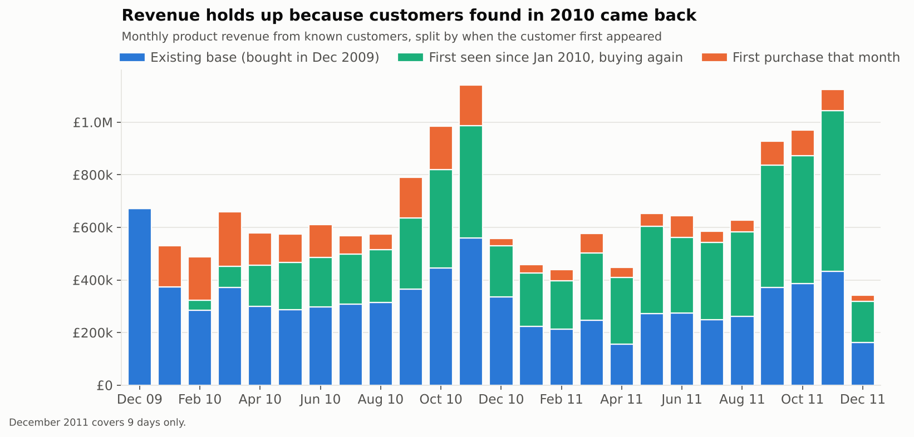
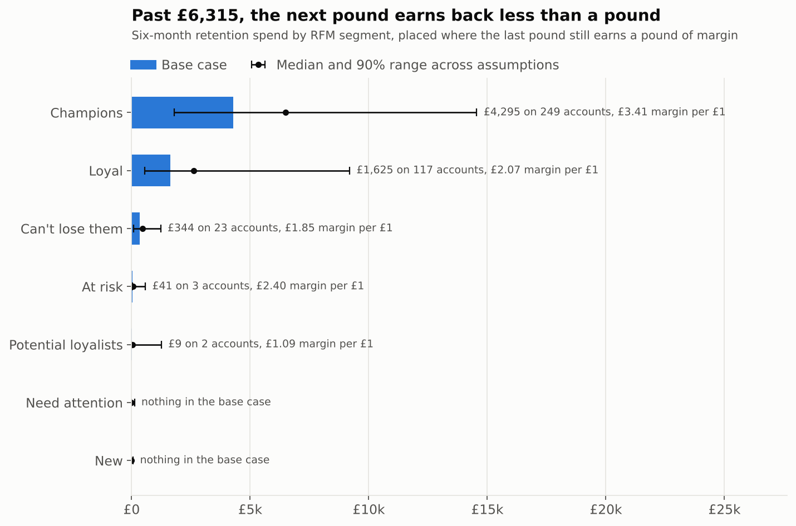

# Customer Value Engine

**Which customers come back, what they are worth over the next six months, and where a retention budget should actually go.**

This project takes two years of real transactions from a UK online wholesaler (1M+ invoice lines, 5,839 identifiable customers) and works through it in four layers. For each customer I wanted a value, an idea of how wrong that value can be, and what to do about it.

| Layer | Question | How |
|---|---|---|
| **1. Diagnose** | Who comes back, how fast, and who does the revenue depend on? | Cohort retention, Kaplan-Meier time to second order, RFM segments, a like-for-like check on acquisition |
| **2. Predict** | What is each customer worth over the next 26 weeks? | MBG/NBD and Gamma-Gamma written from the papers, on a seasonal clock, backtested in both halves of the year against simple baselines |
| **3. Decide** | Where should a £50,000 retention budget go? | Spend placed where the next pound earns the most margin, re-run across 2,000 combinations of the assumptions it depends on |
| **4. Deliver** | How does the business use it? | A Power BI report on a small star schema, plus a ranked target list with an action per account |

<!-- FINDINGS:START -->

## What the data says

- **Half the revenue comes from 273 accounts.** That is 4.7% of 5,839 customers. The top 20% bring in 77%. This is a wholesaler, most customers are small shops, and a few hundred of them carry the business.
- **Most new customers do come back, just slowly.** 42% place a second order within 90 days and 70% within a year (Kaplan-Meier, so recent customers are not counted as lost). A bigger first order is a good sign: 77% of the largest third come back within a year against 61% of the smallest.
- **Customers found in autumn are Christmas buyers.** Of the people who first bought in September to November 2010, only 11% ordered in a typical month over the next nine months, against 21% for customers found earlier in the year. When the next autumn came round it went back up to 18%.
- **New customers did not halve, even though a simple count says they did.** First purchases fell from 2,094 to 1,132 (April to November, 2010 vs 2011), but 2010 only has a few months of history to check against, so returning customers look new. Measured the same way in both years, the count is 2,094 vs 2,155.
- **The value model ranks customers well in both seasons and gets the level right in one of them.** Backtested on 26 weeks it never saw, it was off by -5% in the busy half of the year and +51% in the quiet half. That miss has three causes: only a year of history to learn from, new customers whose early buying burst it took as normal, and a genuinely weak first half of 2011. The top 10% of customers it picked held 63% and 61% of the revenue that actually came in.
- **Next six months from customers known in December 2011: £2.49M to £3.96M.** The model says £3.76M. I plan on the low end, which is the model corrected by its error in the same season last year.
- **Of a £50,000 retention budget, only the first £6,315 earns its keep.** Past that, each extra pound brings back less than a pound of margin, and spending all £50,000 turns a £12,441 gain into a £12,583 loss. The first £6,315, spent on 394 accounts, should bring back about £18,756 of margin. I re-ran the plan across 2,000 combinations of the assumptions it rests on. In 90% of them the point where spend stops paying sits between £2,745 and £26,048, and spreading the full budget evenly loses money in 91% of them.



### What I would do about it

1. **Cap retention spend at around £6,000 for the next six months, not £50,000.** Put the rest somewhere it can be measured, or keep it. The return falls off fast once the few hundred accounts that matter are covered.
2. **Give the top 249 Champions an account manager check-in and first look at new ranges.** They are the largest single line in the plan because a small lift on a large account is worth more than a big lift on a small one.
3. **Call 23 big accounts that have gone quiet, first.** They are the ones the plan picks from the 103 customers in "Can't lose them": large, long histories, and on average a 22% chance they are still active. That is low, but a senior call costs little next to what they used to order.
4. **Run the first campaign as a test, with a holdout.** Randomly keep about a third of the targeted accounts out. This data has no campaign history, so the response numbers in the plan are my assumptions. One properly measured campaign replaces them with facts, and the plan re-runs from `config.toml`.
5. **Push first order size up.** Customers who start with a bigger basket come back more often. A starter pack or a small first-order threshold is worth testing.



The full write up, with every table and chart, is in [REPORT.md](REPORT.md).

<sub>Numbers generated by the pipeline on 06 Oct 2026. Re-running it rewrites this section.</sub>

<!-- FINDINGS:END -->

## Why I built it this way

**I matched cancellations to the orders they reverse.** The raw data has orders like 80,995 units of one item, cancelled twelve minutes later. Dropping cancellation lines is the usual cleaning step, and it keeps that order in, which hands one customer a six-figure lifetime value. Each cancellation is paired with the line it undoes (same customer, product, price and quantity, placed before it) and both go. Partial returns stay in a separate table.

**I checked how things were counted before believing a trend.** The data starts in December 2009, so in 2010 a customer who last ordered in 2008 looks new. Any year on year comparison of "new customers" has to give both years the same lookback first, or it compares two different things.

**I wrote the value models myself and tested them on customers with known answers.** The usual library, `lifetimes`, is no longer maintained and breaks on current pandas. BG/NBD, MBG/NBD and Gamma-Gamma are each about thirty lines of likelihood. The tests simulate customers from known parameters and check the code recovers them, and that its predictions match a Monte Carlo of the same process.

**The models run on a seasonal clock.** BG/NBD assumes a customer's buying rate is the same in January as in November. Here a week in November counts for about two in January. Instead of bolting a correction on afterwards, a week in a busy month counts for more than a week in a quiet one. In the busy season backtest it took the error on the total from -16% to -5%, without touching the ranking. My first version of the seasonal index was biased, and the simulated store caught it: data with no seasons at all came out looking seasonal. The fix is in the decisions log.

**I backtested in the season I forecast, and I report the miss.** The first backtest (busy season) came out at a few percent off. The forecast covers December to June, so I added a second backtest on the quiet half of the year. The model over-predicted it badly. I kept that result in, explain why it happened, and plan on the low end of the range instead of the model's point estimate.

**The budget plan says what it assumes.** There is no campaign data here, so nobody can measure how customers respond to a call or a discount. Those numbers are written down in `config.toml` with ranges, and the plan is re-run across all of them. What matters is which parts of the plan hold across the assumptions.

The full reasoning, including what I tried and dropped, is in [docs/DECISIONS.md](docs/DECISIONS.md).

## Running it

Python 3.10 or newer.

```bash
python -m venv .venv
.venv\Scripts\activate            # Windows. On Mac or Linux: source .venv/bin/activate
pip install -r requirements.txt

python -m clv fetch               # downloads the UCI workbook into data/raw/ (about 45 MB)
python -m clv run                 # all layers, about three minutes
python -m pytest                  # tests run on simulated data, no download needed
```

If the download is blocked on your network, get the zip from the [UCI page](https://archive.ics.uci.edu/dataset/502/online+retail+ii) and put `online_retail_II.xlsx` in `data/raw/`.

`python -m clv run --quick` does fewer bootstrap and sensitivity runs for a fast check. `python -m clv run --synthetic` runs the whole pipeline on the simulated store and writes to `outputs_synthetic/`, so simulated numbers can never end up in this README.

Every judgement call (cleaning lists, holdout length, budget, margin, response assumptions) lives in [config.toml](config.toml). Change it and re-run.

## Power BI

The report is in [powerbi/](powerbi/): open `CustomerValueEngine.pbix` in Power BI Desktop (free, no account needed), or `CustomerValueEngine.pbip` to see the same report as readable files. Four pages: overview, retention, customer value and the budget plan.

It is built from code. `python -m clv powerbi-project` writes the whole Power BI project, data model, relationships, 35 measures, theme and every visual, from [clv/pbip.py](clv/pbip.py), reading the star schema the pipeline puts in `outputs/powerbi/`. If you clone the repo somewhere else, run that command so the report points at your copy of the data, then open the .pbip and click Refresh. [docs/POWERBI.md](docs/POWERBI.md) explains the model and every measure, and how to rebuild it by hand.

## What is where

```
clv/
  data.py         download, read both sheets, check row counts, cache
  clean.py        nine cleaning rules, cancellation matching, audit waterfall
  diagnose.py     cohorts, Kaplan-Meier, RFM, concentration, acquisition check
  models.py       BG/NBD, MBG/NBD, Gamma-Gamma
  predict.py      seasonal clock, two backtests, baselines, forecast
  decide.py       response model, budget optimiser, sensitivity runs
  powerbi.py      star schema for the report
  pbip.py         writes the Power BI report itself as a .pbip project
  report.py       writes REPORT.md, the findings above and the model card
  synthetic.py    a simulated store with planted problems, used by the tests
config.toml       every assumption in one place
docs/             decisions log, model card, Power BI build guide
outputs/          tables, figures, Power BI data (rebuilt by the pipeline)
powerbi/          the Power BI report, .pbix and .pbip
tests/            cleaning, models, pipeline, report text
```

## Data

Online Retail II, by Daqing Chen, from the [UCI Machine Learning Repository](https://archive.ics.uci.edu/dataset/502/online+retail+ii). All transactions of a UK based, non-store online retailer between 01/12/2009 and 09/12/2011. Many of its customers are wholesalers. The raw file is downloaded by the pipeline and is not stored in this repository.
