# Customer Value Engine: full report

Data: UCI Online Retail II, a UK online wholesaler of gift and homeware items. Every invoice line from 01 December 2009 to 09 December 2011. The questions: which customers come back, what they are worth, and where a retention budget should go.

## The data, and what I took out

Every cleaning rule is logged with the rows it removed and the money those rows carried. It is a waterfall, so each row is charged to the first rule that catches it. For reversed orders the value shown is the orders that were cancelled, since each pair nets to zero. Reasons for each rule are in [docs/DECISIONS.md](docs/DECISIONS.md).

| Step | Rows removed | Rows left | Value of removed rows |
|---|---|---|---|
| Raw rows | 0 | 1,067,371 | £0 |
| Sheet overlap | 22,523 | 1,044,848 | £377,488 |
| Exact duplicate line | 11,812 | 1,033,036 | £54,228 |
| Bad debt adjustment | 6 | 1,033,030 | -£147,614 |
| Non-product code | 5,812 | 1,027,218 | £75,712 |
| Zero or negative price | 5,964 | 1,021,254 | £0 |
| Stock adjustment | 0 | 1,021,254 | £0 |
| Missing customer id | 227,089 | 794,165 | £2,568,806 |
| Reversed order (sale + its cancellation) | 11,912 | 782,253 | £545,622 |
| Unmatched cancellation (kept as return) | 11,630 | 770,623 | -£164,331 |

What is left: **770,623 sale lines, 36,337 invoices, 5,839 known customers, £16.52M of product revenue.** 84% of it is from UK customers. Lines with no customer id carried 13.1% of product sales and are out of every customer-level number, so read "customers" as "customers we can identify".

The rule that matters most is matching cancellations to the orders they reverse. 5,956 cancellations were paired with their original lines, taking £545,622 of orders that never really happened out of customer values, including one order for 80,995 units of a single item, cancelled twelve minutes after it was placed.

## 1. Diagnose

### Revenue rests on a few hundred accounts

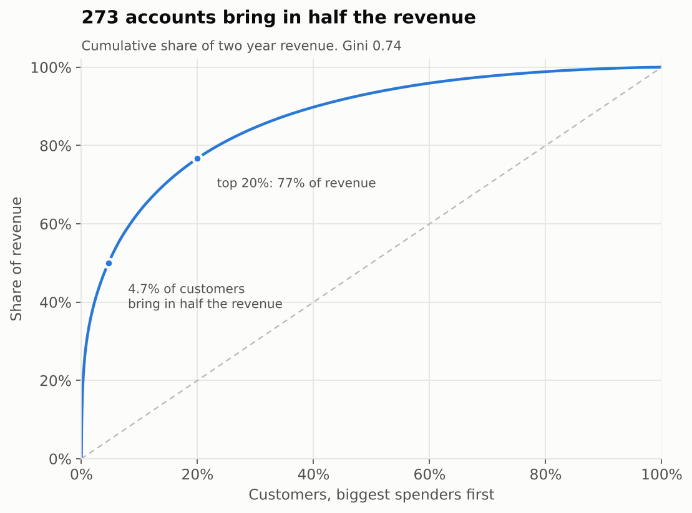

273 customers (4.7%) bring in half the revenue, the top 20% bring in 77%, and the Gini coefficient of customer revenue is 0.74. Any average across "the customer" mostly describes small accounts that matter little, and any plan that treats customers equally spends most of its money where it cannot pay back.

Revenue in 2011 looks healthy, but a large share still comes from customers who were already buying in December 2009, and from customers first seen in 2010. The autumn peak is strong in both years: November runs at close to double a summer month.

### How fast new customers come back

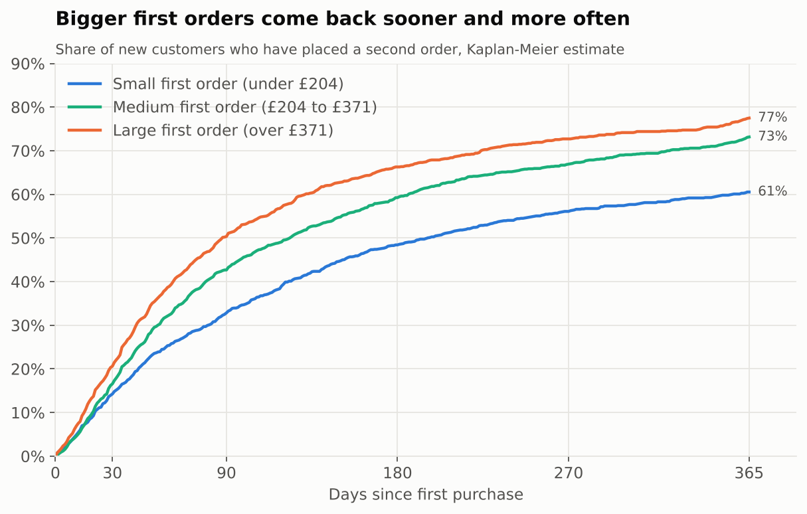

Measured with a Kaplan-Meier estimate so that customers who only arrived recently are not counted as lost, 17% of new customers order again within 30 days, 42% within 90 days and 70% within a year. The median wait for a second order is 126 days.

The size of the first order says a lot. Split into thirds, 77% of customers with the largest first orders are back within a year, against 61% for the smallest. This is correlation, not proof that a bigger first order causes loyalty (bigger shops place bigger orders and also reorder more), but it is cheap to test.

### Cohorts

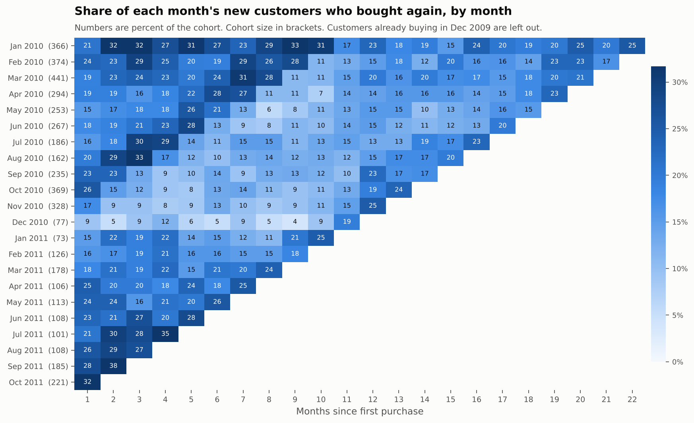

Each row is the customers whose first order fell in that month. About 21% order again the following month (20% for 2010 cohorts, 24% for 2011 cohorts).

The pattern that stands out is the diagonal. Customers first seen in September to November 2010 were active in only 11% of months over the following nine months, against 21% for customers found earlier that year. Then, eleven to thirteen months later, 18% came back. They are Christmas buyers, not lost customers, and judging an autumn campaign by its 90-day repeat rate would undersell it.

The December 2009 row is left out on purpose. Those 951 customers were not new, the data simply starts there.

### New customers did not halve

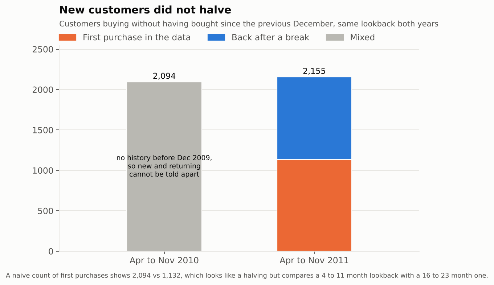

A plain count of "first purchase in the data" for April to November gives 2,094 in 2010 and 1,132 in 2011, which reads as acquisition collapsing. It is mostly a measurement problem. In 2010 the data only looks back a few months, so a customer who last ordered in 2008 looks brand new. Counting both years the same way, customers buying without having bought since the previous December, gives 2,094 and 2,155. In 2011, 1,023 of those were customers returning after a break, which 2010 cannot show.

This data cannot say whether acquisition fell. It can say the chart showing a halving is wrong.

### RFM segments

Recency, frequency and money, each scored 1 to 5 by quintile, as of 10 December 2011. Frequency is the number of different days a customer ordered, so an order split across three invoices on one day counts once.

| Segment | Customers | Share of customers | Share of revenue | Revenue per customer | Median days since last order |
|---|---|---|---|---|---|
| Champions | 868 | 14.9% | 52.5% | £10,002 | 9 |
| Loyal | 1,270 | 21.8% | 30.0% | £3,899 | 53 |
| Potential loyalists | 677 | 11.6% | 2.6% | £626 | 25 |
| New | 25 | 0.4% | 0.0% | £171 | 11 |
| Promising | 70 | 1.2% | 0.1% | £161 | 36 |
| Need attention | 500 | 8.6% | 2.2% | £711 | 97 |
| About to sleep | 93 | 1.6% | 0.1% | £159 | 107 |
| At risk | 859 | 14.7% | 6.2% | £1,194 | 381 |
| Can't lose them | 103 | 1.8% | 4.1% | £6,519 | 309 |
| Hibernating | 550 | 9.4% | 1.0% | £295 | 314 |
| Lost | 824 | 14.1% | 1.3% | £268 | 557 |

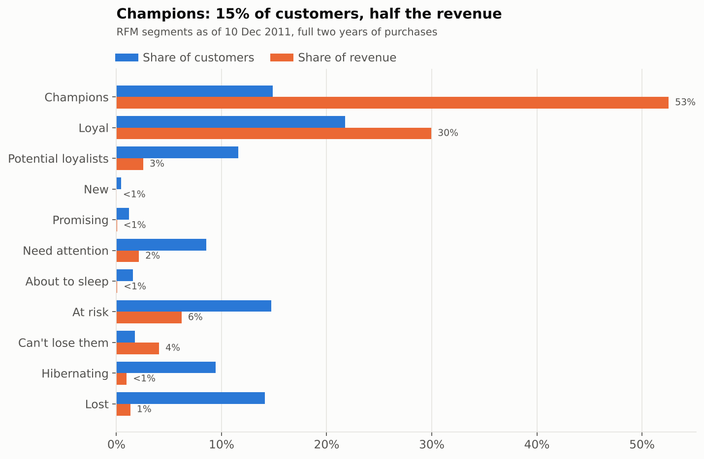

## 2. Predict

The question here is what each customer is likely to spend over the next 26 weeks. Two models do the work:

- **MBG/NBD** for how many orders a customer will place. Each customer buys at their own steady rate while active and may quietly stop after any order, including the first. Nobody tells the shop when a customer leaves, so the model infers it from the gap since the last order compared with that customer's usual rhythm.
- **Gamma-Gamma** for how much each order will be worth. A customer with many orders is predicted close to their own average, a customer with one or two is pulled toward the overall average.

I wrote both from the original papers instead of using the `lifetimes` library, and tested them against simulated customers with known parameters ([models.py](clv/models.py), [tests](tests/test_models.py)).

### Time runs faster in November

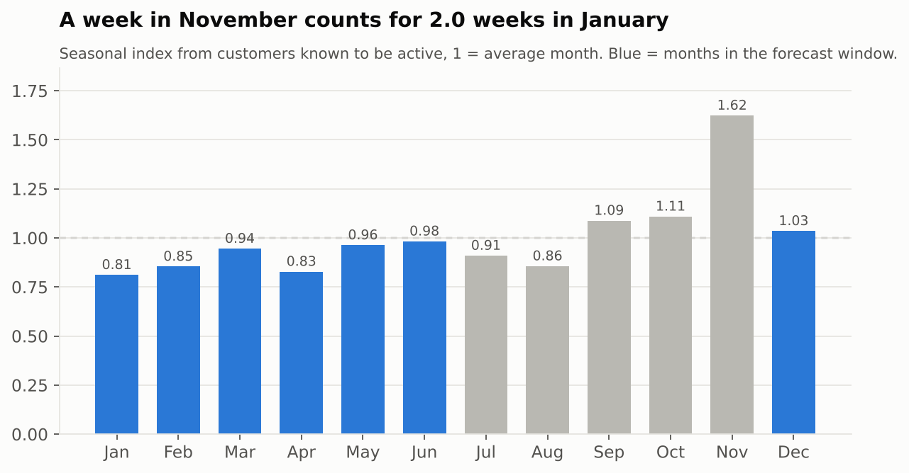

These models assume a customer's buying rate is the same in every week of the year. In this business November runs at 1.62 times an average month and January at 0.81. Rather than correct the forecast afterwards, I measure time in seasonal weeks: a week in a busy month counts for more than a week in a quiet one. The index comes from customers known to be active for the whole stretch (they bought in the four weeks before the cutoff), fitted with a Poisson model that has one fixed effect per customer, so customers joining or leaving cannot pass for seasonality. It is estimated only from data before each cutoff. My first version did let customers leaving pass for seasonality, and the simulated store, which has no seasons at all, is what caught it. The story is in [DECISIONS.md](docs/DECISIONS.md).

### How it was judged

Two backtests, each hiding 26 weeks the model never saw: the busy half of the year (June to December 2011) and the quiet half (December 2010 to June 2011). The quiet half matters most, because that is the season the real forecast covers. Every method predicts the same thing: revenue from customers already known at the cutoff.

| Holdout | Method | Error on total | Rank correlation | Top 10% hold |
|---|---|---|---|---|
| Jun to Dec 2011 (busy season) | MBG/NBD + Gamma-Gamma, seasonal clock | -5% | 0.63 | 63% |
| Jun to Dec 2011 (busy season) | BG/NBD + Gamma-Gamma, seasonal clock | -5% | 0.63 | 63% |
| Jun to Dec 2011 (busy season) | BG/NBD + Gamma-Gamma, calendar clock | -16% | 0.63 | 64% |
| Jun to Dec 2011 (busy season) | MBG/NBD + Gamma-Gamma, calendar clock | -16% | 0.63 | 63% |
| Jun to Dec 2011 (busy season) | Same as last 26 weeks | -29% | 0.57 | 62% |
| Jun to Dec 2011 (busy season) | Historical average rate | +60% | 0.58 | 60% |
| Dec 2010 to Jun 2011 (quiet season) | MBG/NBD + Gamma-Gamma, seasonal clock | +51% | 0.55 | 61% |
| Dec 2010 to Jun 2011 (quiet season) | BG/NBD + Gamma-Gamma, seasonal clock | +51% | 0.55 | 61% |
| Dec 2010 to Jun 2011 (quiet season) | BG/NBD + Gamma-Gamma, calendar clock | +69% | 0.54 | 61% |
| Dec 2010 to Jun 2011 (quiet season) | MBG/NBD + Gamma-Gamma, calendar clock | +69% | 0.54 | 61% |
| Dec 2010 to Jun 2011 (quiet season) | Same as last 26 weeks | +83% | 0.54 | 61% |
| Dec 2010 to Jun 2011 (quiet season) | Historical average rate | +188% | 0.44 | 54% |

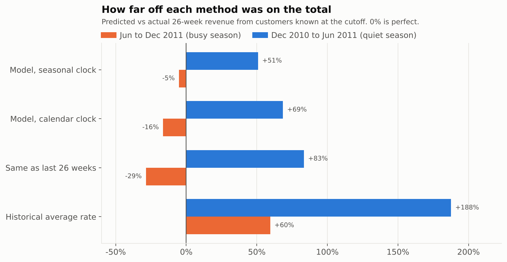

What this says:

- **The ranking holds up.** In both seasons the model's top 10% held 63% and 61% of the revenue that actually arrived. Its rank correlation with actual spend was 0.63 in the busy season against 0.57 for the "same as last 26 weeks" rule, and 0.55 against 0.54 in the quiet one, close to a tie. For deciding who to call first it is at least as good as the simple rule, and its level is far better.
- **The seasonal clock earns its place.** Error on the total moved from -16% to -5% in the busy fold and from +69% to +51% in the quiet one, with no loss in ranking.
- **The level in the quiet season is where it falls down: +51%.** That fold only had one year of history to learn from, new customers buy heavily in their first months and the model takes that burst as their normal rate, and the first half of 2011 was weak: January to May revenue was 9% below the same months of 2010 even though thousands more customers had been acquired by then. A model of each customer's own habits cannot see that coming. Every baseline missed it by more.
- **The plain BG/NBD and the modified version score almost the same.** I use MBG/NBD because plain BG/NBD treats anyone without a repeat order as certainly still active, forever, and the budget plan depends on that probability. MBG/NBD at least lets it fall with time. It still gives one-off buyers a lot of benefit of the doubt (77% to 95% chance of being active), so their value at risk is probably overstated, which if anything makes the plan's case against win-back spend on small accounts stronger.

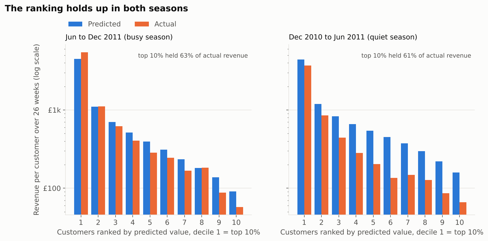

Error on the total, by customer group:

| Group | Error, Jun to Dec 2011 (busy season) | Error, Dec 2010 to Jun 2011 (quiet season) |
|---|---|---|
| Acquired during the data | +0% | +74% |
| Existing base | -11% | +30% |

The quiet season miss is biggest for customers acquired during the data, who had the least history behind them.

Two checks on the spend model:

- Gamma-Gamma assumes order value is unrelated to how often a customer orders. On the final model's data the rank correlation between the two is 0.25, weak but not zero: frequent buyers place slightly bigger orders, so the model slightly under-values its best customers. I have left it and noted it in the model card.
- In the busy season backtest, for customers who did buy, the predicted average order was £420 against an actual £439.

### The forecast

Refitted on all two years, the model expects **£3.76M** from the 5,839 customers known on 09 December 2011 over the 26 weeks to 09 June 2012. Bootstrapping customers puts the parameter uncertainty at only £3.71M to £3.79M, which is far too narrow to plan on, because the real risk is the model being wrong about the business, not the parameters being noisy. The backtests are the better guide, so the planning range is the forecast corrected by each backtest's error: **£2.49M to £3.96M**. The budget plan uses the low end. The same model on a calendar clock would have said £4.36M, because it would treat the quiet months from December to May as average ones.

This covers known customers only. Customers acquired from now on are extra.

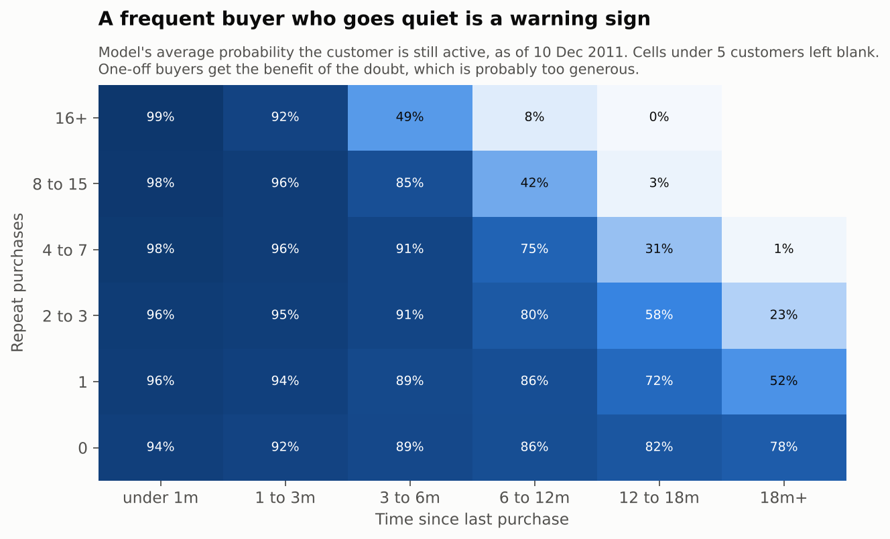

The chart above is the model's view of who is still active. A frequent buyer who has gone quiet for six months or more is probably gone, because the silence is long compared with how often they used to order. A customer with a single repeat order the same time ago has given much less evidence either way, and the model says so.

Parameters: r = 0.740, alpha = 10.01, a = 0.178, b = 3.56 (MBG/NBD, seasonal weeks); p = 2.20, q = 3.60, gamma = 462.9 (Gamma-Gamma). The model card is in [docs/model_card.md](docs/model_card.md).

## 3. Decide

The question: where should a £50,000 retention budget go over the next six months?

### What is measured and what is assumed

The data tells me what each customer is likely to be worth and how likely they are to have already gone. It cannot tell me how customers respond to a call or a discount, because there is no campaign history. So that part is a set of assumptions, written down with a range for each:

| Assumption | Base case | Range tested |
|---|---|---|
| Gross margin | 35% | 25% to 45% |
| Most a campaign adds to an active customer's six-month revenue | 6% | 2% to 12% |
| Share of value at risk a win-back can recover | 15% | 5% to 25% |
| Spend per account that gets two thirds of the effect | £25 | £10 to £50 |
| Customer values | planning case | planning case to raw model forecast |

For each customer, the most a campaign can add is the lift on their expected value plus the recoverable share of their value at risk (what they would be worth if still active, times the chance they have already left). Returns diminish with spend per account. Money goes where the next pound earns the most, and stops where the next pound earns back less than a pound of margin. The full formula is at the top of [decide.py](clv/decide.py).

### The plan

| Segment | Accounts targeted | Accounts in segment | Spend | Expected extra revenue | Margin back per £1 |
|---|---|---|---|---|---|
| Champions | 249 | 868 | £4,295 | £41,852 | £3.41 |
| Loyal | 117 | 1,270 | £1,625 | £9,602 | £2.07 |
| Potential loyalists | 2 | 677 | £9 | £27 | £1.09 |
| At risk | 3 | 859 | £41 | £284 | £2.40 |
| Can't lose them | 23 | 103 | £344 | £1,823 | £1.85 |

Under the base case, **£6,315 of the £50,000 is worth spending**, on 394 accounts, for about £53,588 of extra revenue and £18,756 of margin. That is £12,441 after spend. Spending the whole £50,000, even in the best places available, would turn that into a loss of £12,583.

The rest should not be spent on retaining existing accounts. Most customers are small enough that even a cheap campaign costs more than it can bring back in margin. Winning back lapsed small accounts is the worst use of the money: in "Lost" and "Hibernating" the value at risk averages £13 per customer.

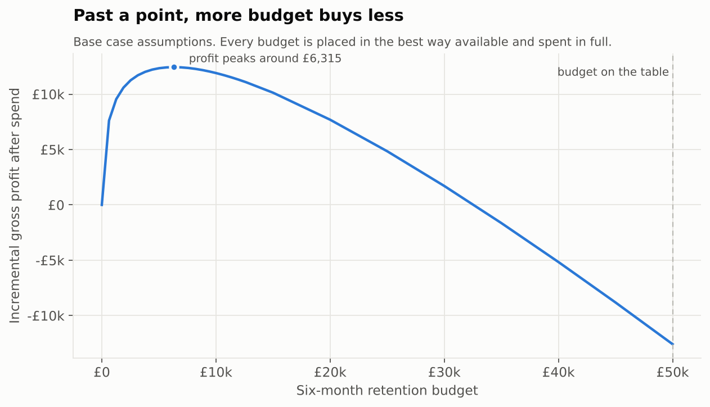

### Compared with plans a team might default to

| Plan | Base case profit | Median across assumptions | 90% range | Loses money in |
|---|---|---|---|---|
| Optimised by expected return | £12,441 | £19,604 | £4,762 to £56,091 | 0% of runs |
| Optimised, but forced to spend it all | -£12,583 | £50 | -£29,498 to £50,414 | 50% of runs |
| Same spend on every customer | -£31,973 | -£28,012 | -£41,542 to £7,686 | 91% of runs |
| Only the best customers | -£22,210 | -£15,013 | -£36,931 to £29,460 | 74% of runs |
| Win back everyone lapsing | -£44,693 | -£43,701 | -£47,119 to -£36,554 | 100% of runs |

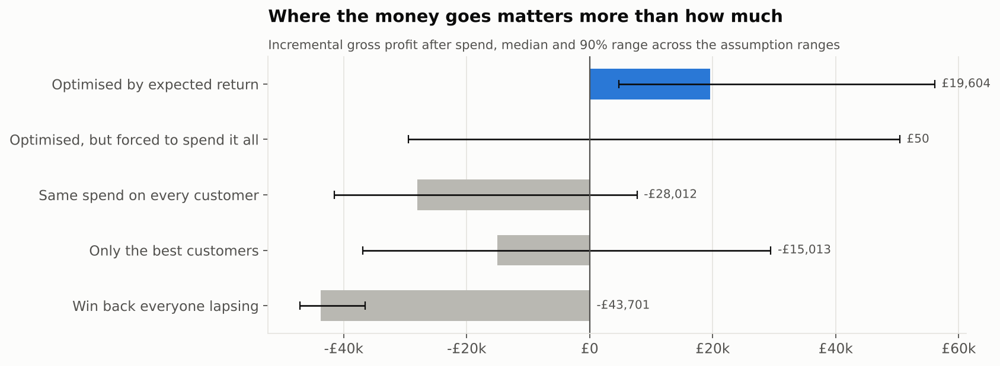

Where to spend and how much to spend behave differently. "Where" holds up whatever the assumptions: the optimised plan beats every simple plan in every run. "How much" depends more on the assumptions: the point where spend stops paying ranges from £2,745 to £26,048 (median £9,775), but it stays below £50,000 in 100% of runs. Forcing the full budget out, even in the best possible places, loses money in 50% of runs.

### How the money moves when the assumptions change

| Segment | Base case | Median | 90% range | Funded in |
|---|---|---|---|---|
| Champions | £4,295 | £6,481 | £1,804 to £14,553 | 100% of runs |
| Loyal | £1,625 | £2,609 | £556 to £9,193 | 100% of runs |
| Potential loyalists | £9 | £31 | £0 to £1,255 | 32% of runs |
| New | £0 | £0 | £0 to £64 | 3% of runs |
| Need attention | £0 | £0 | £0 to £119 | 6% of runs |
| At risk | £41 | £66 | £28 to £579 | 30% of runs |
| Can't lose them | £344 | £466 | £78 to £1,224 | 92% of runs |

"Champions" and "Loyal" get more than £100 in every run. Below that, whether a segment is funded depends on the assumptions, which is a reason to test before spending there.

The full target list, one row per account with the action and the expected return, is in `outputs/tables/decide_target_list.csv`.

## What I would do next

1. **Measure the response.** Run the plan with about a third of targeted accounts held out at random, for one season. That turns the assumption table into measured numbers, and the plan re-runs from `config.toml`.
2. **Add margin by product.** I used one gross margin for everything. Customers who buy mostly low-margin lines are worth less than their revenue says.
3. **Treat seasonal buyers as their own group.** Autumn customers behave differently enough that a separate model, or a covariate for acquisition season, should improve the quiet season forecast.
4. **Re-run monthly.** The scores age quickly for frequent buyers. The pipeline runs in a few minutes, so the target list can be refreshed each month.

## Limitations

- No campaign history, so the decide layer rests on stated assumptions. The sensitivity analysis shows which conclusions survive them.
- Customers without an id (13.1% of product sales) are invisible to every customer-level result.
- The data starts in December 2009 with an existing customer base whose earlier history is unknown.
- Two backtests are not many. I would want a third season before trusting the level of the forecast in a quiet half year.
- The models assume a customer either keeps buying at their usual rate or stops. Real customers also slow down gradually, which is part of why the quiet season was over-predicted.
